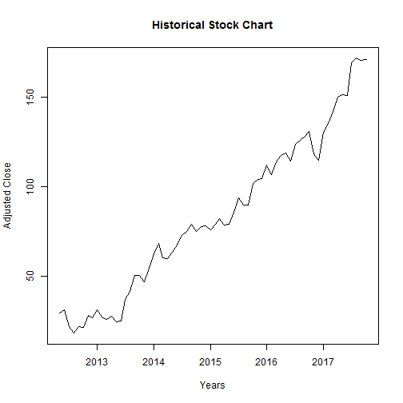

Calculating FAANG returns
========================================================
author: JT
date: 5 October 2017
autosize: true

Summary of FAANGS
========================================================

- FAANGs stands for Facebook, Apple, Amazon, Netflix, and Google. 
- These are five large American technology companies. 
- They are some of the most popular stocks in the market.
- See: http://www.investopedia.com/terms/f/faang-stocks.asp for more information

Description of App
========================================================

- The Shiny application performs the following operations:
  - pulls current stock price information from Yahoo Finance;
  - plots the historical returns since the stock began trading and 
  - calculates the mean (average) monthly log return
  

Example of Plot for Facebook
========================================================


```
time series starts 2012-05-01
time series ends   2017-10-05
```




Purpose of the Application
========================================================

- Show how popular investments have performed.
- Illustrate that hugely popular investments have monthly log returns of <3% (i.e. the power of compound returns).

